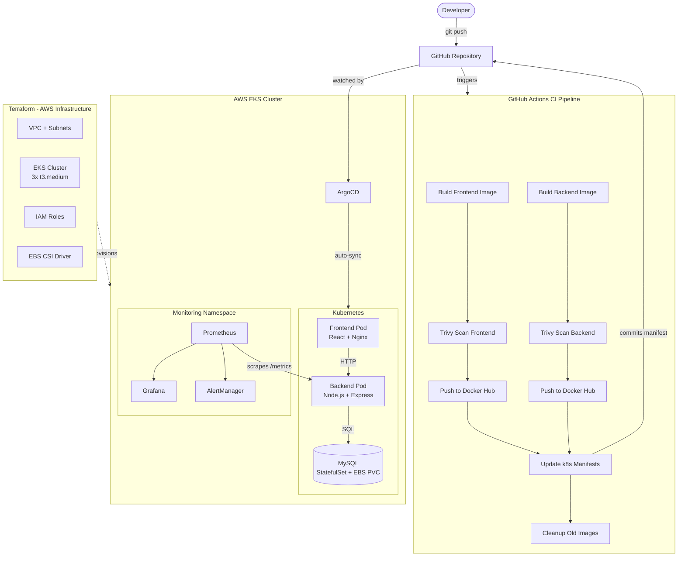

# Student Course Management – DevOps Project

An **end-to-end DevOps project** deploying a Student Course Management application using modern cloud-native practices. The application itself is intentionally simple; the complexity lives in the CI/CD pipeline, security hardening, Kubernetes orchestration, GitOps delivery, and observability stack.

> Designed for production-grade deployment on AWS EKS.

---

## Architecture Diagram



---

## What This Project Demonstrates

| Area | Implementation |
|---|---|
| **CI/CD** | GitHub Actions — build, Trivy scan, push, manifest update, image cleanup |
| **GitOps** | ArgoCD ApplicationSet — auto-sync, self-heal, staging + production |
| **Infrastructure as Code** | Terraform — VPC, EKS, IAM, EBS CSI driver |
| **Security** | JWT auth, bcrypt, Nginx security headers, secret management, CORS lockdown |
| **Observability** | Winston structured logging, Prometheus metrics, Grafana, AlertManager |
| **Containerisation** | Multi-stage Docker builds for frontend (Node → Nginx) and backend |
| **Kubernetes** | Deployments, Services, StatefulSet, PVC, Secrets, ServiceMonitor, PrometheusRule |

---

## Technologies

**Application:** React 19, Node.js, Express 5, MySQL, Axios, JWT (jsonwebtoken), bcryptjs

**Observability:** Winston, Morgan, prom-client, Prometheus, Grafana, AlertManager

**DevOps:** Docker, GitHub Actions, Trivy, ArgoCD, Terraform, Kubernetes (EKS), AWS

---

## Repository Structure

```
.
├── .github/workflows/
│   └── devops.yaml                  # CI: build → scan → push → update manifests → cleanup
│
├── argocd/app/
│   └── applicationset.yaml          # Single ApplicationSet for all environments
│
├── backend/
│   ├── middleware/auth.js            # JWT verification middleware
│   ├── routes/
│   │   ├── auth.js                  # POST /auth/register, POST /auth/login
│   │   ├── students.js              # CRUD /students (protected)
│   │   ├── courses.js               # CRUD /courses (protected)
│   │   └── enrollments.js           # CRUD /enrollments (protected)
│   ├── db.js                        # mysql2/promise connection pool
│   ├── db-init.sql                  # One-time schema setup script
│   ├── logger.js                    # Winston JSON logger
│   ├── metrics.js                   # Prometheus metrics (histogram + counter)
│   └── server.js                    # Express app entry point
│
├── frontend/
│   ├── src/
│   │   ├── components/
│   │   │   ├── Login.js             # Login / Register form
│   │   │   ├── StudentForm.js
│   │   │   ├── CourseForm.js
│   │   │   └── Enrollment.js        # Enroll + unenroll with current enrollment list
│   │   ├── api.js                   # Axios instance with JWT interceptors
│   │   └── App.js                   # Auth guard + logout
│   ├── nginx.conf                   # Custom Nginx config with security headers
│   └── Dockerfile                   # Multi-stage: Node build → Nginx serve
│
├── k8s/
│   ├── backend/                     # Backend Deployment, Service, MySQL StatefulSet, PVC, Secret
│   ├── frontend/                    # Frontend Deployment, Service
│   ├── staging/                     # Staging environment manifests
│   └── monitoring/
│       ├── helm-values.yaml         # kube-prometheus-stack Helm values
│       ├── servicemonitor.yaml      # Prometheus scrape config for backend
│       └── alertmanager-rules.yaml  # Alert rules: crash loop, error rate, latency
│
└── terraform/
    ├── main.tf                      # VPC, EKS, node group, IAM, EBS CSI
    ├── variables.tf
    └── output.tf
```

---

## Local Development

### 1. Initialise the database

```bash
mysql -u root  < backend/db-init.sql
```

This creates `university_db` and all required tables (`users`, `students`, `courses`, `enrollments`). Only needed once.

### 2. Backend

```bash
cd backend
npm install
JWT_SECRET=any_local_secret node server.js
# Runs at http://localhost:5000
```

### 3. Frontend

```bash
cd frontend
npm install
npm start
# Runs at http://localhost:3000
```

---

## CI/CD Pipeline

The pipeline in `.github/workflows/devops.yaml` runs on pushes to `main` and `staging` branches.

```
Build images locally
       │
       ▼
Trivy scan (CRITICAL vulnerabilities → pipeline fails, nothing pushed)
       │
       ▼
Push to Docker Hub
       │
       ▼
Update k8s manifests with new image tag
  main   → k8s/backend/ and k8s/frontend/
  staging → k8s/staging/
       │
       ▼
Commit manifests back to repo (ArgoCD picks up the change)
       │
       ▼
Cleanup old Docker Hub tags (keep last 5)
```

**Required GitHub Secrets:** `DOCKERHUB_USERNAME`, `DOCKERHUB_TOKEN`

---

## Infrastructure (Terraform)

```bash
cd terraform
terraform init
terraform plan
terraform apply
```

Provisions: VPC (10.0.0.0/16), 2 public + 2 private subnets, NAT gateways, EKS cluster (`main_devops-cluster`, us-east-1), managed node group (3× t3.medium, min 2 / max 5), EBS CSI driver addon.

---

## Kubernetes Deployment (ArgoCD)

### 1. Connect kubectl to EKS

```bash
aws eks update-kubeconfig --region us-east-1 --name main_devops-cluster
kubectl get nodes
```

### 2. Install ArgoCD

```bash
kubectl create namespace argocd
kubectl apply -n argocd \
  -f https://raw.githubusercontent.com/argoproj/argo-cd/stable/manifests/install.yaml
```

### 3. Apply ArgoCD ApplicationSet

```bash
kubectl apply -f argocd/app/applicationset.yaml
```

This creates three ArgoCD applications — `backend`, `frontend`, and `backend-staging` — all from one file. To change the repo URL, update it once in `applicationset.yaml`.

### 4. Apply the MySQL Secret

`k8s/backend/mysql-secret.yaml` is excluded from git. Create the file manually using the template below, fill in your values, then apply:

```yaml
apiVersion: v1
kind: Secret
metadata:
  name: mysql-secret
  namespace: backend
type: Opaque
stringData:
  MYSQL_ROOT_PASSWORD: your_root_password
  MYSQL_USER: your_db_user
  MYSQL_PASSWORD: your_db_password
  MYSQL_DATABASE: university_db
```

```bash
kubectl apply -f k8s/backend/mysql-secret.yaml
```

---

## Security

| Layer | What was done |
|---|---|
| **Authentication** | JWT-based login/register. All `/students`, `/courses`, `/enrollments` routes require a valid Bearer token. |
| **Passwords** | Hashed with bcrypt (10 rounds) — plain passwords are never stored. |
| **CORS** | Restricted to origins defined in `ALLOWED_ORIGINS` env var. |
| **Nginx** | Custom `nginx.conf` adds X-Frame-Options, X-Content-Type-Options, X-XSS-Protection, Referrer-Policy, Permissions-Policy, and Content-Security-Policy headers. |
| **Secrets** | `mysql-secret.yaml` is gitignored — only placeholder values exist in the repo. |
| **JWT secret** | Set via `JWT_SECRET` env var. Never hardcoded. |

---

## Monitoring & Observability

### Install kube-prometheus-stack

```bash
helm repo add prometheus-community https://prometheus-community.github.io/helm-charts
helm repo update
helm upgrade --install kube-prometheus-stack prometheus-community/kube-prometheus-stack \
  --namespace monitoring --create-namespace \
  -f k8s/monitoring/helm-values.yaml
```

### Apply monitoring manifests

```bash
kubectl apply -f k8s/monitoring/servicemonitor.yaml
kubectl apply -f k8s/monitoring/alertmanager-rules.yaml
```

### What is monitored

**Structured logs** — every HTTP request and error is logged as JSON by Winston + Morgan. Readable by any log aggregator (CloudWatch, Loki, ELK).

**Metrics exposed at `/metrics`:**
- Default Node.js metrics (CPU, memory, event loop lag)
- `http_request_duration_seconds` — latency histogram per route
- `http_requests_total` — request counter per route and status code

**Alert rules:**

| Alert | Condition |
|---|---|
| `PodCrashLooping` | Pod restarts > 3× in 15 min |
| `PodNotReady` | Pod unavailable for > 2 min |
| `HighErrorRate` | 5xx rate > 5% over 5 min |
| `HighLatency` | p95 latency > 2 seconds over 3 min |

Alerts are received via Email. You can use receive an alert via Slack too and need to update the `k8s/monitoring/helm-values.yaml`.

---

## MySQL Persistence

```
StatefulSet (MySQL)
        │
        ▼
PersistentVolumeClaim  (k8s/backend/mysql-pvc.yaml)
        │
        ▼
PersistentVolume  (AWS EBS gp3 — auto-provisioned)
```

Data survives pod restarts. No manual PV creation needed in EKS.

---

## Frontend → Backend Communication

Inside Kubernetes the frontend image is built with:

```
REACT_APP_API_URL=http://backend-service:5000
```

`backend-service` is a Kubernetes ClusterIP Service — DNS resolution is handled automatically within the cluster.

---

## Author

**Hasan Abdirahman** — Cloud / DevOps Engineer

GitHub: [HasanAbdirahman](https://github.com/HasanAbdirahman) · LinkedIn: [hasan-abdirahman](https://www.linkedin.com/in/hasan-abdirahman/)
